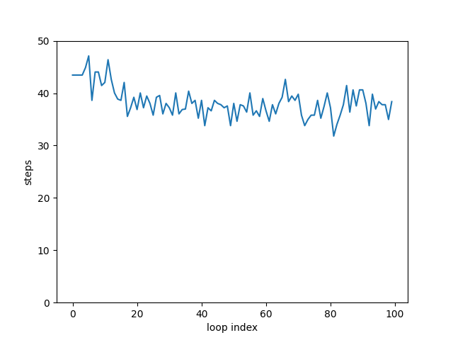

# 蚁群算法(Ant colony)
> matlab代码来源于老师，这里对照实现python版
## Requirements
```
numpy
matplotlib
```
## Usage
```
python py/main.py
```
## matlab版本的不足之处
- 大幅优化了算法效率与可读性。
- 分离参数配置到config.json中。
- matplotlib绘制方形图困难，故打印迷宫走法。
## 结果

```
min length:30.970562748477146
↓ 0 0 0 0 0 1 1 1 0 0 0 0 0 0 0 0 0 0 0
↓ 1 1 0 0 0 1 1 1 0 0 0 0 0 0 0 0 0 0 0
↘ 1 1 0 0 0 1 1 1 0 0 0 0 0 0 0 0 0 0 0
0 ↘ 0 0 0 0 1 1 1 0 0 0 0 0 0 0 0 0 0 0
0 0 → ↘ 0 0 1 1 1 0 0 0 0 0 0 0 0 0 0 0
0 1 1 1 ↓ 0 1 1 1 0 0 0 0 0 0 0 0 0 0 0
0 1 1 1 ↘ 0 1 1 1 0 0 0 0 0 0 0 0 0 0 0
0 1 1 1 0 ↘ 1 1 1 0 1 1 1 1 0 0 0 0 0 0
0 1 1 1 0 0 ↓ 0 0 0 1 1 1 1 0 0 0 0 0 0
0 0 0 0 0 0 ↓ 0 0 0 1 1 1 1 0 0 0 0 0 0
0 0 0 0 0 0 ↓ 1 1 1 1 1 1 1 0 0 0 0 0 0
0 0 0 0 0 0 ↘ 1 1 1 1 1 1 1 0 0 0 0 0 0
0 0 0 0 0 0 0 ↘ 0 0 0 1 1 1 0 1 1 1 1 0
0 0 0 0 0 0 0 0 → ↓ 0 1 1 1 0 1 1 1 1 0
1 1 1 1 0 0 0 0 0 → → ↘ 1 1 0 1 1 1 1 0
1 1 1 1 0 0 1 1 1 1 1 1 ↘ 0 0 0 0 0 0 0
0 0 0 0 0 0 1 1 1 1 1 1 0 ↘ 0 0 0 1 1 0
0 0 0 0 0 0 0 0 0 0 1 1 0 0 ↘ 0 0 1 1 0
0 0 0 0 0 0 0 0 0 0 1 1 0 0 1 → ↘ 0 0 0
0 0 0 0 0 0 0 0 0 0 1 1 0 0 0 0 0 → → 3
或
min length:30.970562748477146
→ → ↘ 0 0 0 1 1 1 0 0 0 0 0 0 0 0 0 0 0
0 1 1 ↓ 0 0 1 1 1 0 0 0 0 0 0 0 0 0 0 0
0 1 1 ↘ 0 0 1 1 1 0 0 0 0 0 0 0 0 0 0 0
0 0 0 0 ↓ 0 1 1 1 0 0 0 0 0 0 0 0 0 0 0
0 0 0 0 ↘ 0 1 1 1 0 0 0 0 0 0 0 0 0 0 0
0 1 1 1 0 ↓ 1 1 1 0 0 0 0 0 0 0 0 0 0 0
0 1 1 1 0 ↓ 1 1 1 0 0 0 0 0 0 0 0 0 0 0
0 1 1 1 0 ↓ 1 1 1 0 1 1 1 1 0 0 0 0 0 0
0 1 1 1 0 ↘ 0 0 0 0 1 1 1 1 0 0 0 0 0 0
0 0 0 0 0 0 ↓ 0 0 0 1 1 1 1 0 0 0 0 0 0
0 0 0 0 0 0 ↓ 1 1 1 1 1 1 1 0 0 0 0 0 0
0 0 0 0 0 0 ↘ 1 1 1 1 1 1 1 0 0 0 0 0 0
0 0 0 0 0 0 0 ↘ 0 0 0 1 1 1 0 1 1 1 1 0
0 0 0 0 0 0 0 0 ↘ 0 0 1 1 1 0 1 1 1 1 0
1 1 1 1 0 0 0 0 0 → → ↘ 1 1 0 1 1 1 1 0
1 1 1 1 0 0 1 1 1 1 1 1 ↘ 0 0 0 0 0 0 0
0 0 0 0 0 0 1 1 1 1 1 1 0 ↘ 0 0 0 1 1 0
0 0 0 0 0 0 0 0 0 0 1 1 0 0 ↘ 0 0 1 1 0
0 0 0 0 0 0 0 0 0 0 1 1 0 0 1 ↘ 0 0 0 0
0 0 0 0 0 0 0 0 0 0 1 1 0 0 0 0 → → → 3
```