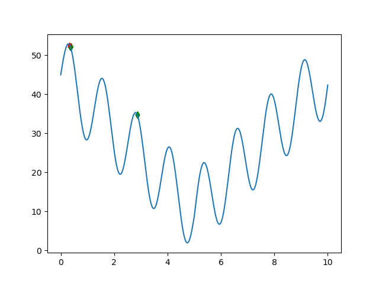

# 遗传算法(Genetic Algorithm)
> matlab代码来源于老师，这里对照实现python版

使用json保存配置。位置在./resources/config.json下。  
## Requirements
```
numpy
matplotlib
```
## Usage
```
python py/main.py
```
## matlab版本的不足之处
- 在matlab的代码中，chromlength为10，能表示2^10=1024个表现型，但是却生成了1000的种群大小，也就是说，即使不进入遗传迭代，一开始也很可能能直接随机到最优解。python的默认config.json调整种群大小为100，以说明遗传算法的作用。
- matlab版本的代码，超参数的分离情况较差，binary2decimal函数使用了写死的1023(2**10-1),python代码统一抽取到config.json中，方便调整基因长度和其他配置项。  
- matlab代码在最后绘图时，使用了上一次迭代的fitvalue和本轮迭代的pop，在loop足够大时不易发现，但loop低时很明显，python版做了调整。
- matlab代码在绘制最优解时使用了y1而不是bestfit，导致最优的x对应了多个y(图中的红色点)，python做了调整。
## 结果
  