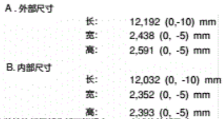
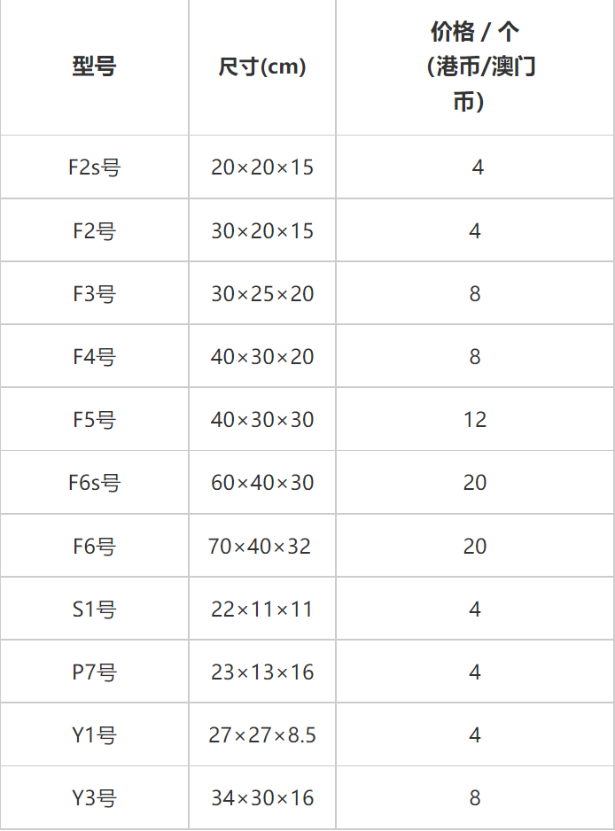

# 在线算法
## 问题定义
物流公司在流通过程中，需要将打包完毕的箱子装入到一个货车的车厢中，为了提高物流效率，需要将车厢尽量填满，显然，车厢如果能被100%填满是最优的，但通常认为，车厢能够填满85%，可认为装箱是比较优化的。  
设车厢为长方形，其长宽高分别为L，W，H；共有n个箱子，箱子也为长方形，第i个箱子的长宽高为li，wi，hi（n个箱子的体积总和是要远远大于车厢的体积），做以下假设和要求：  
1. 长方形的车厢共有8个角，并设靠近驾驶室并位于下端的一个角的坐标为（0,0,0），车厢共6个面，其中长的4个面，以及靠近驾驶室的面是封闭的，只有一个面是开着的，用于工人搬运箱子；  
2. 需要计算出每个箱子在车厢中的坐标，即每个箱子摆放后，其和车厢坐标为（0,0,0）的角相对应的角在车厢中的坐标，并计算车厢的填充率。

问题分解为基础和高级部分，完成基础部分可得78分以上，完成高级部分可得85分以上。  
基础部分：  
1. 所有的参数为整数；
2. 静态装箱，即从n个箱子中选取m个箱子，并实现m个箱子在车厢中的摆放（无需考虑装箱的顺序，即不需要考虑箱子从内向外，从下向上这种在车厢中的装箱顺序）；
3. 所有的箱子全部平放，即箱子的最大面朝下摆放；
4. 算法时间不做严格要求，只要1天内得出结果都可。  

高级部分：  
1. 参数考虑小数点后两位；
2. 实现在线算法，也就是箱子是按照随机顺序到达，先到达先摆放；
3. 需要考虑箱子的摆放顺序，即箱子是从内到外，从下向上的摆放顺序；
4. 因箱子共有3个不同的面，所有每个箱子有3种不同的摆放状态；
5. 算法需要实时得出结果，即算法时间小于等于2秒。

## 思路
### 如何描述状态空间
算法的关键在于描述三维空间在某一时间断面的状态，即放入货物i后的空间占用及空闲状态。  
可以使用二维数组+一维高度的形式描述状态空间。  
即将对于长宽高均为5的状态空间，在起始时表示为：
```
{
    5, 5, 5, 5, 5,
    5, 5, 5, 5, 5,
    5, 5, 5, 5, 5,
    5, 5, 5, 5, 5,
    5, 5, 5, 5, 5,
}
```
以数组原点作为空间原点，优先在靠近坐标原点处放置货物，则在放入货物(2, 3, 4)后，空间可以表示为：
```
{
    1, 1, 1, 5, 5,
    1, 1, 1, 5, 5,
    5, 5, 5, 5, 5,
    5, 5, 5, 5, 5,
    5, 5, 5, 5, 5,
}
```
### 如何进行状态转移
对于第i个货物(i_l, i_w, i_h)，要找到空间中的一片位置可以放置它，即在space中找到(i_l, i_w)大小的矩阵，矩阵内部的所有元素均大于i_h。  
由于货物是在线给出的，且规模远大于空间大小，故只要满足上述条件，无需考虑空间潜力。  
在放入该货物后，令该矩阵的值取矩阵内的最小值(存在部分空间被覆盖了)。  
如果不是在线问题，而是静态问题，可以将箱子按照(长,宽,高)的优先顺序排列，使得不存在悬空情况，提高空间利用率。
## Requirements
```
python>=3.8
numpy
```
## 参数设置
### 车箱
我们选择所有集装箱中最大的40英寸国际标准集装箱确定车箱大小。(更小的车箱大小的复杂度更低。)  
查询 [40英尺国际标准通用集装箱说明书](https://max.book118.com/html/2020/0927/6020042014003002.shtm)

  

不妨设车箱长12.20m，宽2.44m，高2.90m（保留2位小数，以满足题设）。
### 箱子
选取顺丰快递提供的各类包装箱的尺寸标准。  
查询 [顺丰包装物料](https://htm.sf-express.com/HK/sc/products_services/Express_Services/Value_added_Services/SF_Packing_Materials/)

  

不妨设箱子的边长为0.08m~0.53m的随机数。
## Usage
```
# 按照参数生成4000个货物，期望体积1.25倍于空间体积
python tool/static.py

# 在线放入
python solution/3d-map.py
# 放入的箱子的大小和位置会在脚本执行完毕后保存到result_pos.txt下，可以使用ctrl+c终止脚本，同样也会进行保存。
```
## 性能
3d-map脚本附带了每次放入箱子的性能统计，以下附带笔者的执行性能统计。   
| 性能影响 | 数值 |
| --------| ------|
|CPU|12th Gen Intel(R) Core(TM) i7-1260P|
|CPU基频|2.10 GHz|
|笔记本|省电模式|
|python|3.9.12|
|numpy|1.23.4|

| 性能统计 |数值 |
| --------| ------|
| 总箱子 |3002个|
| 放入箱子| 2859个|
| 放入率|95.24%|
| 空间利用率|89.32%|
| 脚本执行总时间| 586s|
|单位箱子放入时间|0.195s|