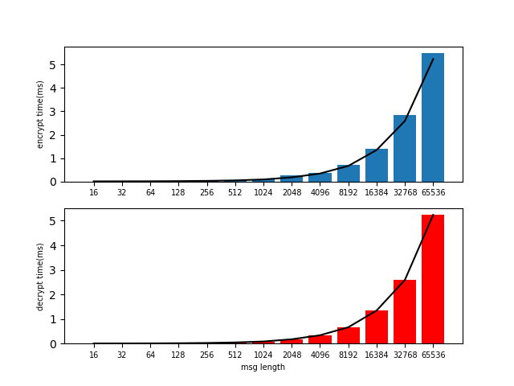

# SM4对称加密算法的C++实现
[English](README_en.md) | 中文
> 参考 [pypi库 sm4](https://pypi.org/project/sm4/) 实现
## 环境需要
```
linux
cmake
```
## 编译
```
bash build.sh
```
## 二进制使用
```
# 在栈上申请的空间，故请确保msg不太大。
# 在编译产物.sm4_build目录下
# 加密
sm4 -k key -e plaintext
# 解密
sm4 -k key -d ciphertext
```
注意：
- SM4算法要求密钥是16字节(128位)，对不足16字节的key会用0填充至16字节，超出的则截取前16字节。  
- 待加密明文需要是16字节的倍数，如果不是，会用0填充。  
- 待解密密文需要是16字节的倍数，如果不是，会用0填充。在解密完成后，会删除填充的字符。  
## 库使用
拷贝安装目录.sm4_install到您的项目，引用include下的头文件，链接lib下的静态库或动态库。  
## 性能
  
64  Intel(R) Xeon(R) Gold 6138 CPU @ 2.00GHz